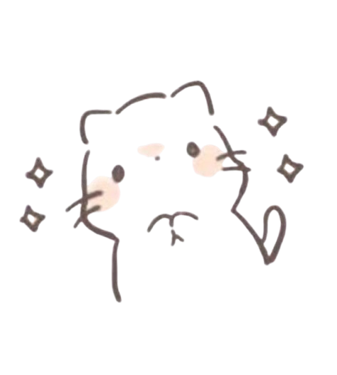

<div class="article-header green-white">

<div>

<div class="decorative-element"></div>

# YAYTYY DECORATIVE ELEMENT

OMG HOVER OVER IT!!

</div>



</div>

Starting with the Quartz 4 basic templates, today was focused on designing and changing some core features of Quartz to be to my ideal expression.

These include:

- Fixing absolute link '/' issues
- Changing the design, finally agreeing to go with https://toolbox.socratica.info/
  - A lot of styling changes!
  - Text
  - Margin
- Recent Notes
- Recent Writing (Inspired by https://jzhao.xyz/)
- Text shortcut buttons (Inspired by https://8cat.life/)
- Fix Code block background
- And all the other bugs that came during the way...

I don't think I'll be happy with the design, still trying to figure out how I want this to all appear.
I do like the scratch paper format.

Things for tomorrow:

- [x] Fix social images
  - [x] https://quartz.jzhao.xyz/features/social-images
- [ ] ~~Figure out day note system, what to contain, or how to build in public~~
- [x] Start draft of first important note, the home note.
- [x] Add important links on bottom, link to repo, personal github, and linkedIn?
- [x] Home banner - So happy how this banner came out to be!!

# Sed pace coeptis removit

## Sub sunt desint dicere

Lorem markdownum hora: reposcunt cecidit Oebalio rubescere iugera nec passu alto
nobilitate. Natus in nullo sororum, valles felix nepotes, nec invictumque ut
deum, est foedabis ille crines! Sceptrum litus; locum petiisse et profuit manus,
inquit movebant fata a et aram. Hippason
[e](http://tantorumherbae.net/acui.html) terra iuvenes, properantibus _hinc
habent_ cum unda capillis sidus ipsum nisi.

```js
if (ram) {
  user += alignment + 5 - ospfIcmp.alpha(98)
  postscriptNntpBittorrent = byte
} else {
  webmasterNui.usb.memory(gopher_gigaflops(zettabyte_dv_and, post), torrent(unicode_iteration))
}
java = scarewareSaasRight.standalone(wysiwyg(icioDashboardVeronica), 1)
databaseEngine += dataKey.drive.sdsl(1, ospf_direct_mouse)
var white_restore = search_zebibyte_boot.user(clean_menu, cgiProgrammingCompatible * chipset, 2)
```

Facit iuvabat coniugis solitus vile mixtos cetera amnis discedens convocat
minus? Ityosque **parem**. Umor dubito, pendentemque patria, parato in matri
tollere: nova non, fervebant sede lenita liquida nymphas. Maeoniaeque tetigit
dicens Pithecusas ab sol Melampus, os tu alti et totque, e!

## Fer tecum exiguumque viribus vana

Longam toro carpitur ut hosti iura vitam alimentaque nempe officium nostros,
quas putri, gemitu saepe, rogari. Quae artus veneni quas: aliquis cecidit
exanimi; duos naribus oras frigora neque. Regale non fastigia **pericula**
dimovit, vivere increpat concita.

1. Hunc ipso intrasse petebar nigrescere versae pacis
2. Loquentis obliqua umeris enim inmittitur
3. Erat Aiax virgineumque condi

Cassis queri mea adit est ait certe fama [quod](http://nec.net/respicit.html)
congestaque fuit. Sum reppulit visa quendam haec, prodibant validi argenti
arbore dumque.

Mortales Phineus scelus pectora umbras parent _pondere suasisse pudicos_ verba.
Pennis ripam. Et virgo ardore primitias, eiectatamque cessit hominum non quod.
